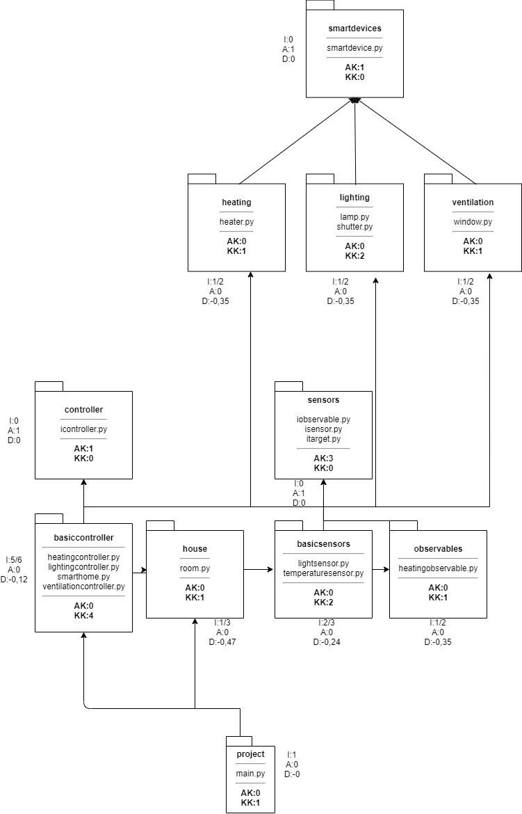

# Smarthome Projekt
This repository is made to implement some classes for a simple smarthome system.

# SOLID - Prinzipien
### SRP (Single Responsibility Principle)
* TODO
### OCP (Open Closed Principle)
* TODO
### LSP (Liskov Substitution Principle)
* TODO
### ISP (Interface Segregation Principle)
* TODO
### DIP (Dependency Inversion Principle)
* TODO

# RCC & ASS - Prinzipien
### REP (Release Reuse Equivalency Principle)
* TODO

### CCP (Common Closure Principle)
* TODO

### CRP (Common Reuse Principle)
* TODO

### ADP (Acyclic Dependencies Principle) -> siehe Package-Metrik
* Anhand der Package Metrik lässt sich erkennen, dass keine Zyklen zwischen den Packages besteht

### SDP (Stable Dependencies Principle)
* Unsere Packets hängen nur von Packets höherer Stabilität ab (Instabilität nimmt zu)

### SAP (Stable Abstractions Principle)
* Die instabilen Packages enthalten bei uns keine Abstrackten Klassen.

# Design Patterns
## Creational patterns
* hier hat sich für unser Beispiel kein Pattern geeignet

## Structural patterns
* 

## Behavioral patterns
* Observer --> wurde genutzt um ein "heatingobservable" zu erstellen. Gibt weiter sobald die Zieltemperatur erreicht ist.
* Template Method --> Der Controller ist hierbei der abstrakte "worker" und alle spezifischen Controller greifen auf ihn zu.
