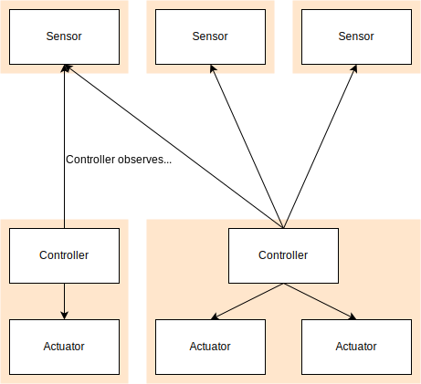

# Smart Home

This is not fully fledged smart home system since it only consists of example packages to demonstrate a certain architectural style - just like the motto: _Ceci n'est pas une smart home_.
This includes structure of modules and packages as well as Design Patterns (creational, structural and behavioral) introduced by the _Gang of Four_.

## Documentation

There are three main classes/objects: sensors, actuators and controllers.
A controller reads data of all sensors it needs and then controls the actuators.

All sensors and actuators have a name and are assigned to a room.
They get instanciated in the main class and stored in a dictionary to access them by their name.

Since controllers are invoked by sensors when their value change (Observer Pattern) everything runs automatically.
Nevertheless it is also possible to explictly run all controllers.

Controllers are packaged by use cases, e.g. there is one package for basic operations (lights, heating, ...), one for kitchen, security (alarms), ...

For testing there is a CLI to manipulate the sensor values and see whether the controllers update the actuators as expected.
The CLI doesn't include functionality to add room, sensors or actuators because it doesn't make sense to change the structure of the smart home during runtime (smart home is static in it's structure of sensors and actuators).

**`Sensor`**:
The `getValue()`-method reads the current value and returns it.
The `readValue()`-method should read the value from the real sensor, so it needs to be implemented specifically for each sensor.
If there are different sensors (e.g. multiple temperature sensors from different vendors and different interfaces) then it would be useful to implement a class for a temperature sensor and additionally for each device model a new class to read the value from this specific device type.
The `readValue()`-method should only read from the sensor.
Steps to convert a value to a standardized format should be implemented in `parseValue()`.
The `setValue()`-method can be used to inject values but **must** be also used in `readValue()` so that other steps connected to setting a value are processed automatically (parsing the value, notifying observers).

**`Controller`**:
The `main()`-method can be invoked regularly so that the controller can check whether actuators should be updated.
This can be useful if there are time-based decisions, but currently it is not really neccessary.
The `update()`-method is invoked everytime a value of an observed value changes.
This includes also the information which sensor invoked the method and what it's current value is.

## SOLID

* **S**RP: A concrete sensor class is only responsible for reading the real value from the physical device (e.g. is the LightPushButton pressed?). A concrete actuator is only responsible for carrying out a specific task (e.g. switching light on). A controller implements the logic (e.g. if LightPushButton is pressed &rarr; switch lights on). With this a change in logic does not affect sensor or actuator implementations. In reverse changes in devices/hardware do not affect the logic (Controller).
* **O**CP: Sensors as a whole are created equally and support basic methods (read(), set(), Observer-Pattern, ...), but can be further extended with device-specific functionalities.
* **L**SP: In general subclasses do not change the functionality of inherited methods since they do not overwrite them. In certain cases methods are overwritten but still have the same basic functionality, e.g. setValue() of LightPushButton sets the value as expected but immediately resets it like the physical device does.
* **I**SP: There are different types of lamps: single- and multi-colored (and in future further like dimmable). These are different interfaces which offer different functionalities. This means clients only have a specific interface according to their needs.
* **D**IP: see [metrics](#metrics).

## RCC & ASS

* **R**EP: Abstract classes all use common interfaces to communicate, because of this changes occur not as often this makes it easier to reuse. Concrete implementations of items are ordered by the needs of clients, e.g. controller packages are divided into different use cases like security or kitchen.
* **C**CP: The division into different packages is really important for the development of a smart home system. On one hand changes of one class will likely occur in classes used for the same purposes as well (e.g. the sensor classes implement a common interface), on the other hand it is easier to understand what the main objective of that class is.
* **C**RP: In the smarthome system sensors and actuators are used together because the values raised by sensors influence the actuators significantly. Hence they are part of the item package.

- **A**DP, **S**DP, **S**AP: Dependencies are always directed to packages which are more abstract and stable than themselves, see [metrics](#metrics).

## Metrics

## Remarks and Ideas

**REMARK**:
Sensors and actuators currently have bad metrics, because they are not abstract, but are stable. Because of this further improvements to the smarthome system have to include the refactoring of those classes. We recommend changing all current sensors and actuators into abstract classes which are used by classes more accurate representations of real items. A good example is the `Microphone`. We opted to use it as our concrete implementation, but after calculating the metrics we came to the conclusion you should use `Microphone` as a superclass and implement subclasses like `amazon-echo-input`.
So in general this means: The abstract class `Sensor` defines the general interface for all sensors. Special classes for different types of sensors (temperature, light, motion, ...) extend this interface if needed or implement general logic for this types of devices. These have subclasses which then implement some details for a certain device (this means a physical device from a certain vendor and thus a certain hardware interface) like `readValue()` or `parseValue()`. They do not extend the interface so that clients can use the interface of the more general sensors(-types) (Narrowing Cast).

**QUESTION**:
Should `Controller`'s behave as a `Proxy` for `Actuator`'s so that every `Actuator` has only one `Controller` through which it can be controlled.
This would mean that e.g. `VoiceController` would need to access `Controller`'s instead of `Actuator`'s directly.

**IDEA**:
Use just one `FireAlertController` (`Singleton`?) which receives the whole `SmartHome` as an argument and can then take values of all `Sensor`'s it needs (`SmokeDetector`, `TemperatureSensor`, ...).
This could make it easier to implement new features for `FireAlertController` in the future.

**IDEA**:
The `house` can be expanded by `floors` or other `house`-related entities. This way specialized `rooms` like a `garage` can have their own classes and still be part of the `house`-package.

**REMARK**:
The `VoiceAssistant` is currently part of the `kitchen`-package, because it's implemented that way and only works for items inside the room _kitchen_. In case the `VoiceAssistant` gets new functionality that doesn't concern the kitchen it has to have it's own `assistant`-package. (Why is it not in that package already? We love agile developement and want our code to be as easy to understand as possible. Because of this we decided to limit the `VoiceAssistant` to only be responsible for controlling items in this specialized room. We have given some thought to the bigger picture already, but we argue that implementing things only serving a purpose in the future can be considered to be part of a waterfall approach and only complicate the code.)
